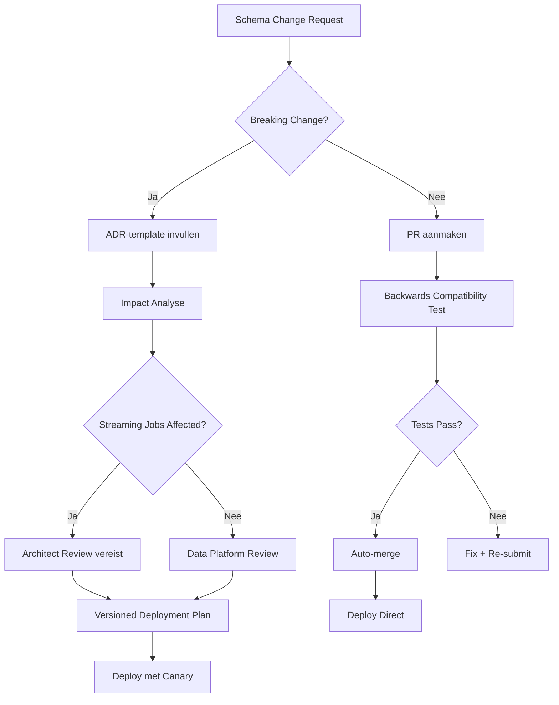

# Schema Governance — LogiTech Fleet Platform

**Versie**: 1.0  
**Eigenaar**: Data Platform Team  
**Laatste Update**: 2026-01-08

## Overzicht

Dit document definieert de governance voor event contracts en schema evolution. **Schema drift kan streaming jobs breken en alerts stil leggen** — strikte controle is kritisch.

## Ownership Model

| Aspect | Eigenaar | Approval Process |
|--------|----------|------------------|
| **Canoniek Telemetry Contract** | Data Platform Team | ADR required |
| **Breaking Changes** | Data Platform Team + Architect | ADR + Impact analyse |
| **Non-Breaking Changes** | Data Platform Team | PR review |
| **Schema Registry Access** | Data Platform Team | Admin-only |

## Schema Registry

### Tool Keuze

**Optie 1: Azure Schema Registry** (aanbevolen voor Azure-native)  
**Optie 2: Confluent Schema Registry** (bij gebruik van Kafka)

### Configuratie

```json
{
  "compatibility": "BACKWARD",
  "validateOnWrite": true,
  "namespace": "com.logitech.fleet.telemetry",
  "versioningScheme": "SEMANTIC"
}
```

## Canonical Event Contract

### TelemetryEvent v1.0.0

```json
{
  "$schema": "http://json-schema.org/draft-07/schema#",
  "title": "TelemetryEvent",
  "version": "1.0.0",
  "type": "object",
  "required": ["event_id", "timestamp", "vehicle_id", "event_type"],
  "properties": {
    "event_id": {
      "type": "string",
      "format": "uuid",
      "description": "Unieke event identifier"
    },
    "timestamp": {
      "type": "string",
      "format": "date-time",
      "description": "ISO 8601 timestamp (UTC)"
    },
    "vehicle_id": {
      "type": "string",
      "pattern": "^VEH[0-9]{6}$",
      "description": "Voertuig identifier (bijv. VEH001234)"
    },
    "event_type": {
      "type": "string",
      "enum": ["position", "ignition", "diagnostic", "alert"],
      "description": "Type event"
    },
    "payload": {
      "type": "object",
      "description": "Event-specific data (schema afhankelijk van event_type)"
    },
    "schema_version": {
      "type": "string",
      "pattern": "^\\d+\\.\\d+\\.\\d+$",
      "description": "Semantic version (1.0.0)"
    }
  },
  "additionalProperties": false
}
```

### Event Type Schemas

#### Position Event
```json
{
  "latitude": {"type": "number", "minimum": -90, "maximum": 90},
  "longitude": {"type": "number", "minimum": -180, "maximum": 180},
  "speed_kmh": {"type": "number", "minimum": 0},
  "heading_degrees": {"type": "number", "minimum": 0, "maximum": 360}
}
```

## Schema Evolution Policy

### Backward Compatible Changes ✅

**Toegestaan zonder architect review:**

- Nieuwe **optionele** velden toevoegen
- Nieuwe **event types** toevoegen aan enum
- Documentatie updates
- Beschrijving updates

**Voorbeeld:**
```diff
{
  "properties": {
    "vehicle_id": {...},
+   "driver_id": {
+     "type": "string",
+     "description": "Optionele chauffeur ID"
+   }
  }
}
```

### Breaking Changes 🔴

**Architect review verplicht + ADR:**

- Velden **verwijderen**
- Veldtypes **wijzigen** (bijv. string → number)
- **Verplichte velden** toevoegen
- Enum waarden **verwijderen**
- Schema **major version** bump (v1.x → v2.0)

**Voorbeeld (FOUT):**
```diff
{
  "properties": {
-   "vehicle_id": {"type": "string"},
+   "vehicle_id": {"type": "integer"}  # BREAKING!
  }
}
```

## Change Approval Process



## Impact Analysis Template

Voor elke schema wijziging:

```markdown
# Schema Change Impact Analysis

## Change Summary
- **Schema**: TelemetryEvent
- **Version**: 1.1.0 (was 1.0.0)
- **Type**: [Breaking / Non-Breaking]

## Changes
- Added field: `driver_id` (optional string)

## Impact Assessment
- [ ] **Bronze Layer**: Geen impact (append-only)
- [ ] **Streaming Jobs**: Backwards compatible (optioneel veld)
- [ ] **Silver Layer**: Update validatie logica
- [ ] **Gold Layer (dbt)**: Geen impact
- [ ] **Consumers**: Dashboard moet field negeren (graceful degradation)

## Rollback Plan
Als nieuwe field problemen veroorzaakt:
1. Revert Schema Registry naar v1.0.0
2. Streaming jobs blijven werken (backwards compatible)
3. Events met driver_id worden geaccepteerd maar genegeerd

## Testing
- [ ] Backwards compatibility test passed
- [ ] Streaming job integration test passed
- [ ] 2 trucks canary deployment (week 1)
```

## Schema Validation

### Event Hub Input Validation

```python
# databricks/schema_validation/validate_incoming_events.py

from pyspark.sql.types import StructType, StructField, StringType
import json

def validate_schema(event_json: str, schema_version: str):
    """Validate event tegen Schema Registry."""
    schema = get_schema_from_registry(schema_version)
    
    try:
        jsonschema.validate(json.loads(event_json), schema)
        return True
    except jsonschema.ValidationError as e:
        # Log naar DLQ
        write_to_dead_letter_queue(event_json, error=str(e))
        return False
```

### Monitoring

```sql
-- Dashboard: Schema validation errors per dag
SELECT 
  DATE(timestamp) as error_date,
  schema_version,
  COUNT(*) as validation_errors
FROM monitoring.schema_validation_errors
GROUP BY error_date, schema_version
ORDER BY error_date DESC;
```

## Versioning Strategy

### Semantic Versioning

- **Major (v2.0.0)**: Breaking changes
- **Minor (v1.1.0)**: Backwards compatible features
- **Patch (v1.0.1)**: Backwards compatible bug fixes

### Multi-Version Support

**Tijdens transitie periode:**
- Schema Registry ondersteunt v1.0.0 EN v2.0.0
- Streaming jobs kunnen BEIDE versies lezen
- Producers migrerennaar nieuwe versie via canary

```python
# Voorbeeld: Multi-version support
if event.schema_version.startswith("1."):
    parse_v1(event)
elif event.schema_version.startswith("2."):
    parse_v2(event)
else:
    raise UnsupportedSchemaVersion(event.schema_version)
```

## ADR Template voor Schema Changes

Zie: `docs/architecture_decision_records/ADR-TEMPLATE-schema-change.md`

```markdown
# ADR-XXX: [Schema Change Title]

**Status**: [Proposed / Accepted / Deprecated]
**Datum**: YYYY-MM-DD

## Context
Waarom is deze schema wijziging nodig?

## Beslissing
Welke velden worden toegevoegd/gewijzigd/verwijderd?

## Consequenties
### Pros
- ...

### Cons
- ...

## Impact
- Streaming jobs: [list]
- Batch jobs: [list]
- Consumers: [list]

## Migration Plan
Stappen voor veilige uitrol
```

## Compliance

- **Kwartaal Review**: Alle schema wijzigingen van afgelopen kwartaal
- **Lineage Tracking**: Azure Purview automatisch bijgewerkt
- **Audit Trail**: Alle wijzigingen in Git + Schema Registry logs
